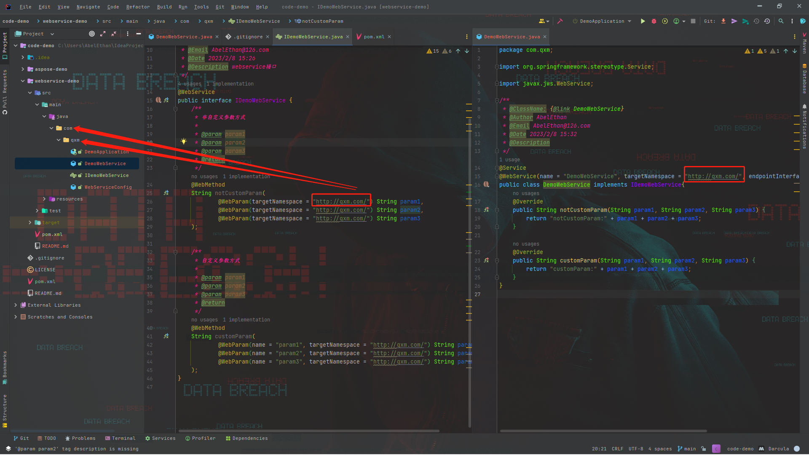
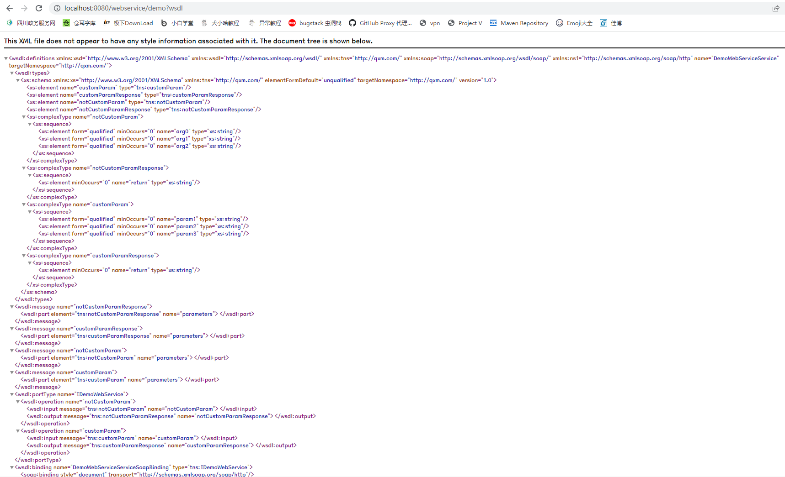
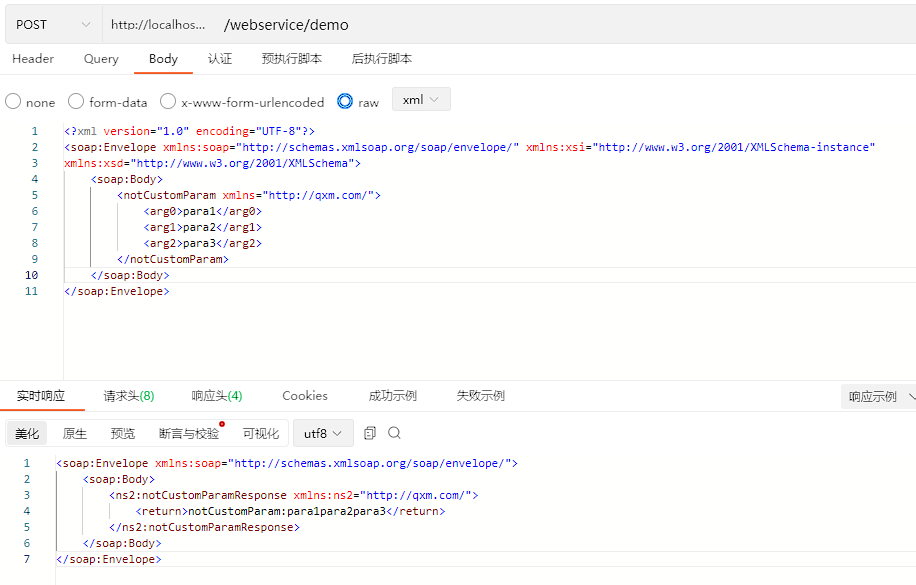
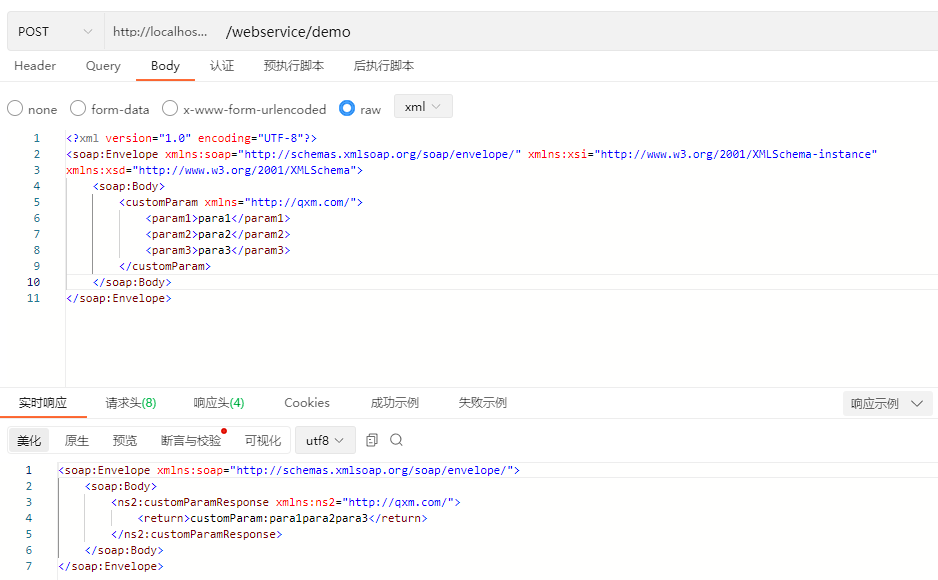

> 使用`SpringBoot`整合`WebService`记录。

1. 映入依赖 `pom`
   ```xml
     <dependency>
         <groupId>org.springframework.boot</groupId>
         <artifactId>spring-boot-starter-web</artifactId>
         <version>${spring.boot.version}</version>
         <exclusions>
             <exclusion>
                 <groupId>org.springframework.boot</groupId>
                 <artifactId>spring-boot-starter-tomcat</artifactId>
             </exclusion>
         </exclusions>
     </dependency>
     <dependency>
         <groupId>org.springframework.boot</groupId>
         <artifactId>spring-boot-starter-undertow</artifactId>
         <version>${spring.boot.version}</version>
     </dependency>
     <dependency>
         <groupId>org.springframework.boot</groupId>
         <artifactId>spring-boot-starter-web-services</artifactId>
         <version>${spring.boot.version}</version>
         <exclusions>
             <exclusion>
                 <groupId>org.springframework.boot</groupId>
                 <artifactId>spring-boot-starter-tomcat</artifactId>
             </exclusion>
         </exclusions>
     </dependency>
     <dependency>
         <groupId>org.apache.cxf</groupId>
         <artifactId>cxf-spring-boot-starter-jaxws</artifactId>
         <version>3.4.4</version>
     </dependency>
   ```

2. 创建 `IDemoWebService` 接口（***传参方式类似mybatis，可以指定参数名，不指定参数名就用（arg0-argn）来代替***）

   ```java
   @WebService
   public interface IDemoWebService {
       /**
        * 非自定义参数方式
        *
        * @param param1
        * @param param2
        * @param param3
        * @return
        */
        @WebMethod
        String notCustomParam(
                 @WebParam(targetNamespace = "http://qxm.com/") String param1,
                 @WebParam(targetNamespace = "http://qxm.com/") String param2,
                 @WebParam(targetNamespace = "http://qxm.com/") String param3
        );
   
   
       /**
        * 自定义参数方式
        *
        * @param param1
        * @param param2
        * @param param3
        * @return
        */
       @WebMethod
       String customParam(
               @WebParam(name = "param1", targetNamespace = "http://qxm.com/") String param1,
               @WebParam(name = "param2", targetNamespace = "http://qxm.com/") String param2,
               @WebParam(name = "param3", targetNamespace = "http://qxm.com/") String param3
       );
   }
   ```

3. 创建 `DemoWebService` 实现类

   ```java
   @Service
   @WebService(name = "DemoWebService", targetNamespace = "http://qxm.com/", endpointInterface = "com.qxm.IDemoWebService")
   public class DemoWebService implements IDemoWebService{
        @Override
        public String notCustomParam(String param1, String param2, String param3) {
            return "notCustomParam:" + param1 + param2 + param3;
        }
   
        @Override
        public String customParam(String param1, String param2, String param3) {
            return "customParam:" + param1 + param2 + param3;
        }
   }
   ```
   >  这里要注意`targetNamespace`必须是和目录对应
      

4. 创建配置文件 `WebServiceConfig`
   ```java
   @Configuration
   public class WebServiceConfig {
   @Autowired
   private IDemoWebService demoWebService;
   
       @Autowired
       private Bus bus;
   
       @Bean
       public ServletRegistrationBean cxfServlet(){
           return new ServletRegistrationBean(new CXFServlet(), "/webservice/*");
       }
   
       @Bean
       public Endpoint demoWebserviceEndPoint(){
           EndpointImpl endpoint = new EndpointImpl(bus, demoWebService);
           endpoint.publish("/demo");
           return endpoint;
       }
   }
   ```

5. 测试访问

    - 访问`http://localhost:8080/webservice/demo?wsdl`
      

    - 访问notCustomParam方法
      

    - 访问customParam方法
      